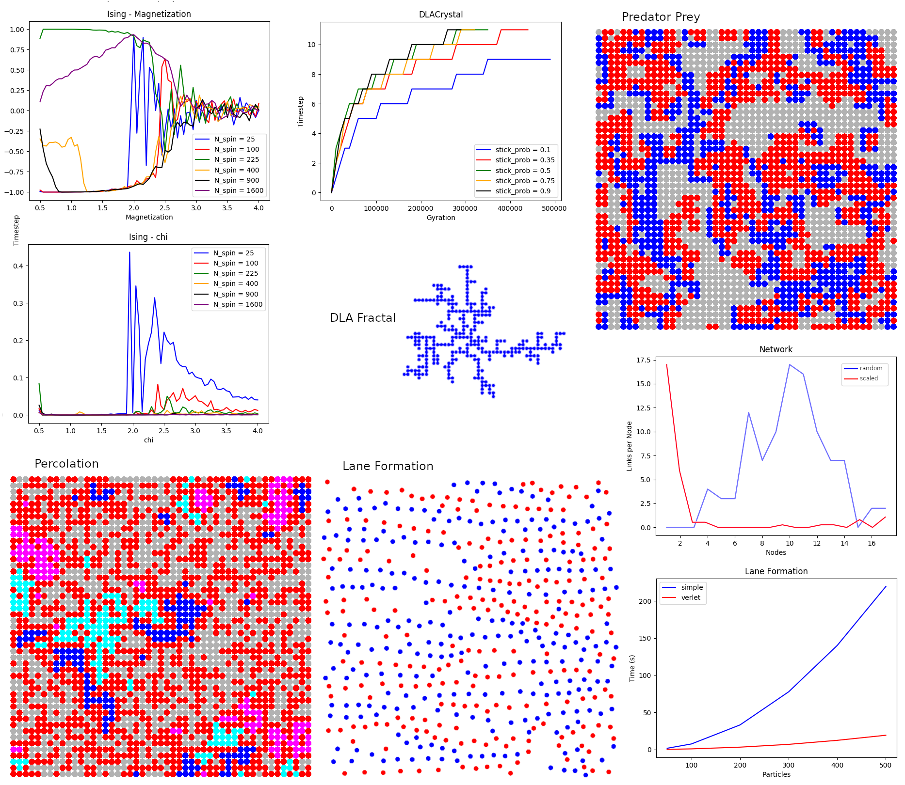

Simulation Methods Labs:
* molecular dynamics - lane formation, pinning sites
* Monte Carlo methods - ising model, percolation simulation, diffusion limited
aggregation crystal growth
* cellular automaton - prey predator system
* complex networks generation

